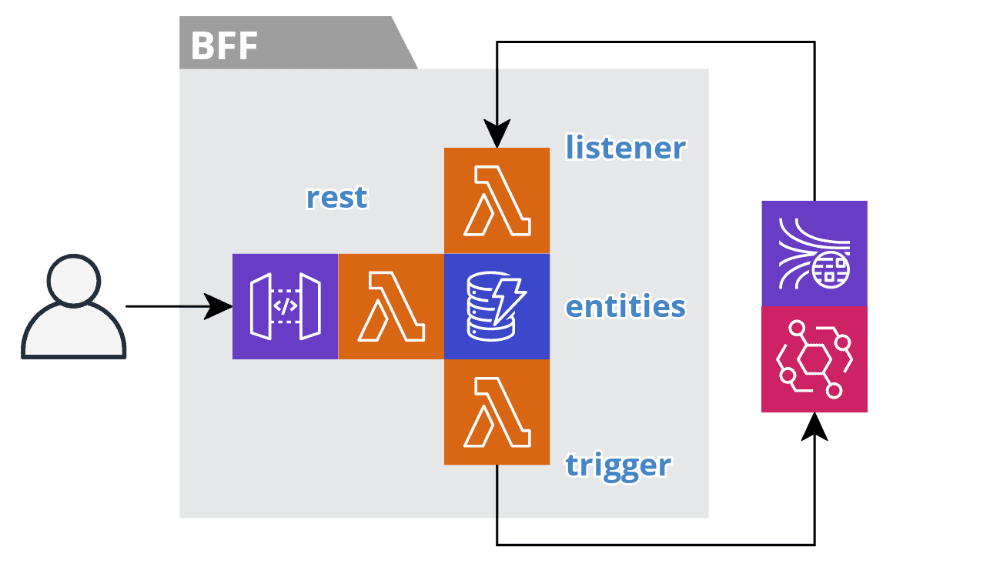

# template-bff-service

backend for a react front end, https://github.com/AlexNovitchkovBurbank/website-react-ts. Is the bff caled the performance-service with a dynamoDb table. It sends an sns message to a performance-search-bff, with its own dynamoDb table via sqs.
